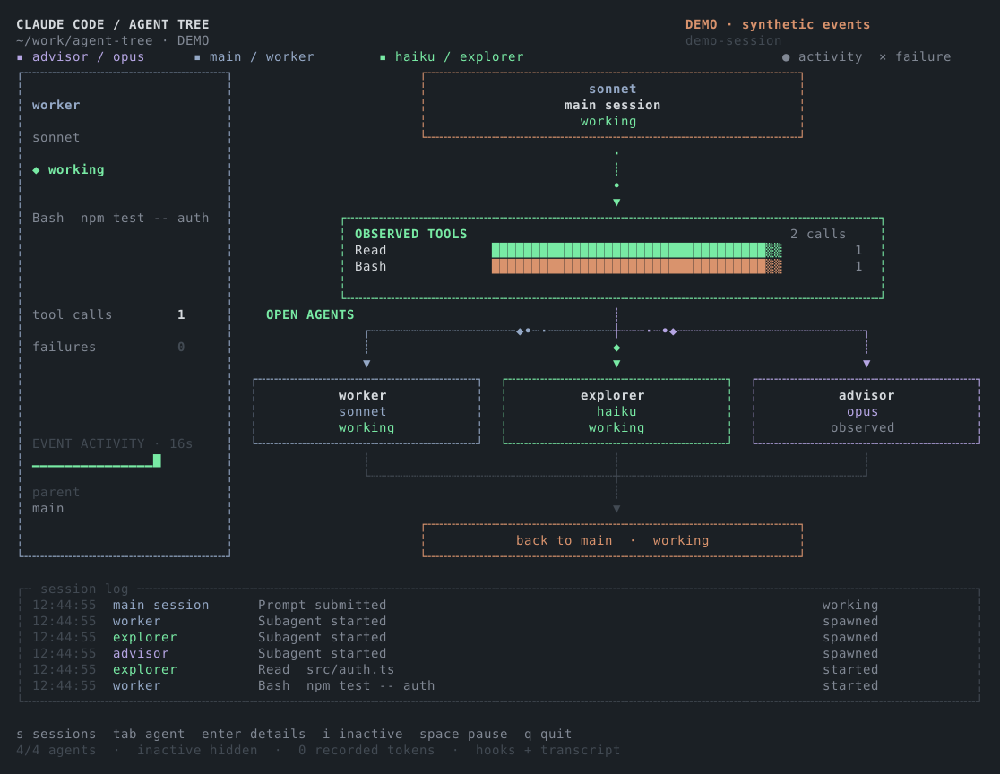

```text
                                               ░██               ░██
                                               ░██               ░██
 ░██████    ░████████  ░███████  ░████████  ░████████         ░████████ ░██░████  ░███████   ░███████
      ░██  ░██    ░██ ░██    ░██ ░██    ░██    ░██    ░██████    ░██    ░███     ░██    ░██ ░██    ░██
 ░███████  ░██    ░██ ░█████████ ░██    ░██    ░██               ░██    ░██      ░█████████ ░█████████
░██   ░██  ░██   ░███ ░██        ░██    ░██    ░██               ░██    ░██      ░██        ░██
 ░█████░██  ░█████░██  ░███████  ░██    ░██     ░████             ░████ ░██       ░███████   ░███████
                  ░██
            ░███████
```

**A live terminal dashboard for Claude Code. See your agents, subagents and tool calls as they happen, without touching a thing.**

Python 3.10+ · Linux / macOS (WSL works) · zero dependencies · no network · read-only


<sub>A real capture: Agent Tree watching the very session that wrote this README, with three subagents exploring the repo.</sub>

## Quick start

```sh
git clone https://github.com/niemes/cc-agent-tree.git
cd cc-agent-tree
python3 agent_tree.py        # or ./agent-tree
```

Pick a session with ↑ / ↓ and Enter, then carry on using Claude Code in your other terminal. No session handy? Try the fake one:

```sh
python3 agent_tree.py --demo
```

You need a true-colour terminal with a monospace font and at least **84 × 40** cells (124 × 48 looks nicer). Without a TTY it just tells you to use `--list` or `--snapshot`.

## What is this, exactly?

Claude Code can fan out into subagents, and once it does, a lot happens that you can't see. Agent Tree tails the transcript files Claude already writes to `~/.claude/projects/*/*.jsonl` and draws the lot as a live map:

- the **main session** at the top, with its model and state
- an **observed tools** panel: your three most-used tools, as real counts
- a **card per open subagent**, with its model, current action and status
- an **inspector** on the left for whichever agent you've tabbed to
- a **session log** along the bottom

It's an observer. It can't send prompts, steer agents or approve permissions, and it makes no network calls or extra model usage.

## Controls

| View | Key | Does |
| --- | --- | --- |
| Picker | ↑ / ↓, Enter | Select a session, listen to it |
| Picker | type, Backspace, Ctrl-U | Filter by project, title or session ID |
| Picker | `d` (empty filter) | Open the demo |
| Dashboard | Tab / arrows | Inspect another agent (pages automatically) |
| Dashboard | Enter | Toggle the selected agent's log |
| Dashboard | `i` | Show / hide inactive and unknown-state subagents |
| Dashboard | Space | Pause / resume |
| Dashboard | `s` | Back to the picker |
| Dashboard | `q` / Esc | Quit |
| Picker | Esc | Quit (`q` just types into the filter) |
| Anywhere | Ctrl-C | Quit (terminal is restored) |

## CLI flags

| Flag | Does |
| --- | --- |
| `--demo` | Looping synthetic events, always labelled **DEMO** |
| `--list` | Print discovered sessions as JSON |
| `--session PATH` | Attach straight to one transcript `.jsonl` |
| `--claude-dir PATH` | Where Claude's data lives (default `$CLAUDE_CONFIG_DIR` or `~/.claude`) |
| `--events-dir PATH` | Where hook events live (default `$AGENT_TREE_EVENTS_DIR` or `~/.local/state/agent-tree/events`) |
| `--fps N` | Redraw rate, 1 to 30 (default 12) |
| `--snapshot FILE` | Write an SVG of the demo screen |

## Optional: the hook plugin

Transcripts alone get you most of the way. For crisper lifecycle events (subagent start/stop, waiting for permission, session end, compaction), load the bundled plugin when you start Claude:

```sh
claude --plugin-dir /absolute/path/to/cc-agent-tree/plugin
```

Then run the dashboard separately as usual. Leave `--plugin-dir` off next time and it's gone.

- The hook is silent, returns no decisions and never touches your global settings.
- It appends rows to `~/.local/state/agent-tree/events/<session-id>.jsonl` (private permissions).
- It stores ids, tool names, models and short file paths / descriptions / patterns. **Never** prompts, source code, command output or full commands.
- Paths can still be sensitive, so mind that. Everything stays local, and these files aren't rotated, so tidy up now and then.

## Reading the screen

- **Open agents** are subagents with a live start or recent activity and no stop yet. Press `i` to include closed and historical ones.
- The horizontal bus means *same session*, **not** a verified parent/child tree. Known parents show in the inspector; unknown ones stay unknown. Parent links are never guessed.
- **Pulses** are recent observed events, not packets or token throughput. **Event activity** is new events per second over the last 16 seconds.
- **Recorded tokens** are summed from assistant message usage, deduplicated by message ID. That's not billing and not context-window usage.
- **Observed** means a tool returned but no turn-end was seen. **Last seen** means history held unfinished work and liveness is unknown. **Complete** means an explicit stop was observed.
- Colours follow role: lavender for Opus / advisor, mint for Haiku / explorer, slate blue for the rest, orange for orchestration and waiting, red for failure.

## How it works

| File | Job |
| --- | --- |
| `model.py` | Incremental JSONL tailing, session discovery, event correlation, state |
| `ui.py` | Renders a grid of coloured cells (raw ANSI and Unicode, no curses) |
| `agent_tree.py` | CLI, input loop, picker, demo |
| `plugin/` | The optional hook bridge (`emit.py`) |

A few things that might save you a head-scratch:

- It **polls**. Each tick reads at most 2 MiB, holds back half-written lines and copes with truncation and file replacement. New subagent files are looked for about once a second.
- Hook rows and transcript rows are deduplicated, so running both at once is safe.
- On launch, history is replayed quietly. Anything still "working" afterwards becomes **last seen**, because an old unfinished call doesn't prove a live process.
- Everything shown goes through a sanitiser that strips control and escape characters.

## Fair warning

Claude's transcript format is an implementation detail and can change, so older or odd layouts may need an adapter update. Agent Tree is tested against generated transcript fixtures, hook payloads and real pseudo-terminal sessions, and the screenshot above is a live session (transcript-only, no plugin loaded). Hook mode isn't shown in that screenshot and is covered by the tests, so check the counters against your own setup before leaning on them.

The smooth curves and moving dots in the visual it was inspired by are approximated with Unicode characters, so how it looks depends on your terminal and font.

## Demo, without Claude



<sub>Synthetic demo data from `--demo` (regenerate with `--snapshot`), not a live run.</sub>

## Tests

```sh
python3 -m unittest discover -s tests -v
```

Fifteen tests: partial writes, file replacement, discovery, deduplication, token accounting, agent lifecycle, dynamic subagents, escape sanitising, several viewport sizes, hook filtering, inactive toggling, and a pty run of the picker with live appends.

## References

- [Claude Code hooks](https://code.claude.com/docs/en/hooks)
- [Claude Code plugins](https://code.claude.com/docs/en/plugins)

Version 0.1.0
