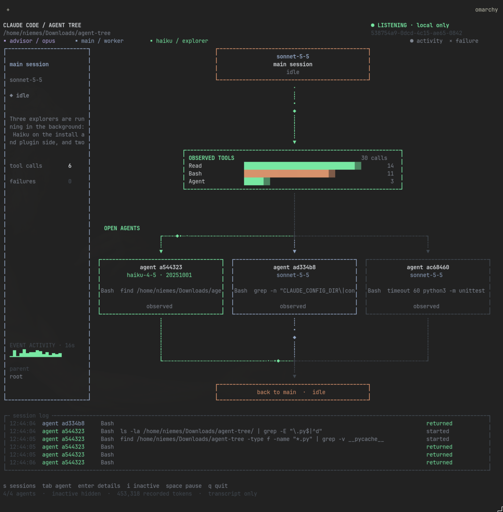

```text
 ▄▄▄   ▄▄▄▄ ▄▄▄▄▄ ▄▄  ▄▄ ▄▄▄▄▄▄   ▄▄▄▄▄▄ ▄▄▄▄  ▄▄▄▄▄ ▄▄▄▄▄
██▀██ ██ ▄▄ ██▄▄  ███▄██   ██  ▄▄▄  ██   ██▄█▄ ██▄▄  ██▄▄
██▀██ ▀███▀ ██▄▄▄ ██ ▀██   ██       ██   ██ ██ ██▄▄▄ ██▄▄▄
```

**A live terminal dashboard for Claude Code. Watch your agents, subagents and tool calls as they happen.**

Python 3.10+ · Linux / macOS (WSL works) · zero dependencies · no network · read-only



<sub>A real capture: Agent Tree watching the session that wrote this README.</sub>

## Quick start

```sh
git clone https://github.com/niemes/cc-agent-tree.git
cd cc-agent-tree
python3 agent_tree.py          # pick a session with ↑/↓ + Enter
python3 agent_tree.py --demo   # no session handy? fake one
```

Needs a true-colour terminal, monospace font, at least 84 × 40 cells. Other flags: `--help`.

## What it does

It tails the transcripts Claude already writes to `~/.claude/projects/*/*.jsonl` and draws the main session, your most-used tools and a card per open subagent. It only observes: it can't send prompts, steer agents or approve permissions.

## Keys

- **Picker:** `↑/↓` select, `Enter` listen, type to filter, `d` demo, `Esc` quit
- **Dashboard:** `Tab` next agent, `Enter` agent log, `i` show inactive agents, `Space` pause, `s` back to picker, `q` quit
- `Ctrl-C` quits from anywhere

## Optional: hook plugin

Transcripts are enough for most things. For subagent start/stop, permission waits and compaction events, start Claude with the bundled plugin:

```sh
claude --plugin-dir /absolute/path/to/cc-agent-tree/plugin
```

It writes ids, tool names and short paths (never prompts, code or output) to `~/.local/state/agent-tree/events/`. All local, never rotated, so tidy up now and then.

## Heads-up

- The bus between cards means "same session", not a verified parent/child tree.
- "Recorded tokens" come from message usage. They are not billing.
- Claude's transcript format is internal and can change.
- The screenshot is transcript-only. Hook mode is covered by tests, not shown live.

## Tests

```sh
python3 -m unittest discover -s tests -v
```

## License

MIT, see [LICENSE](LICENSE).
